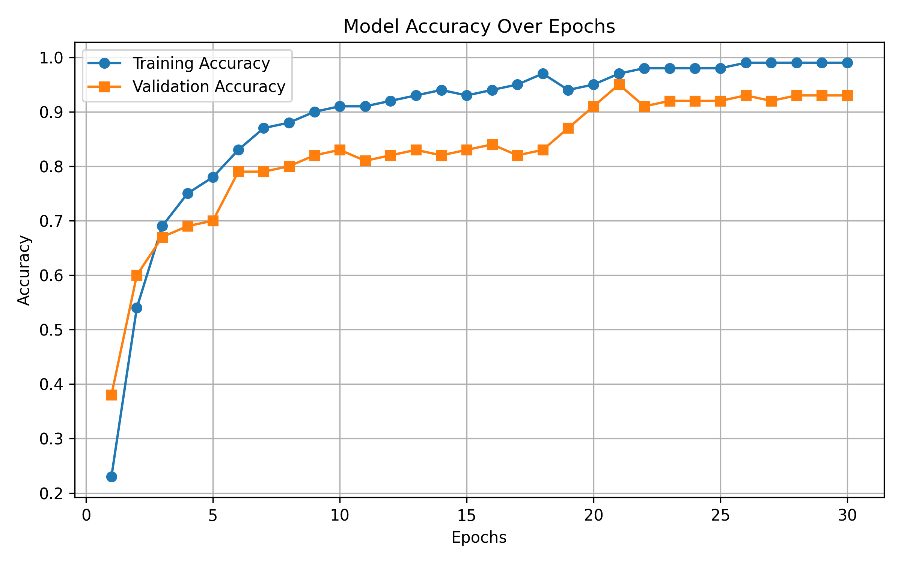
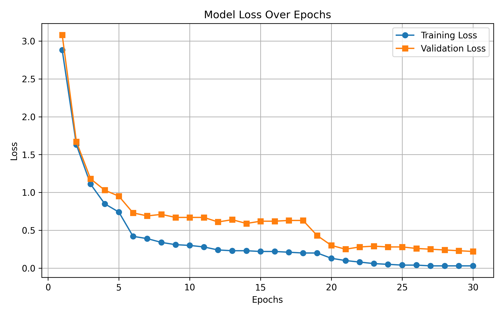
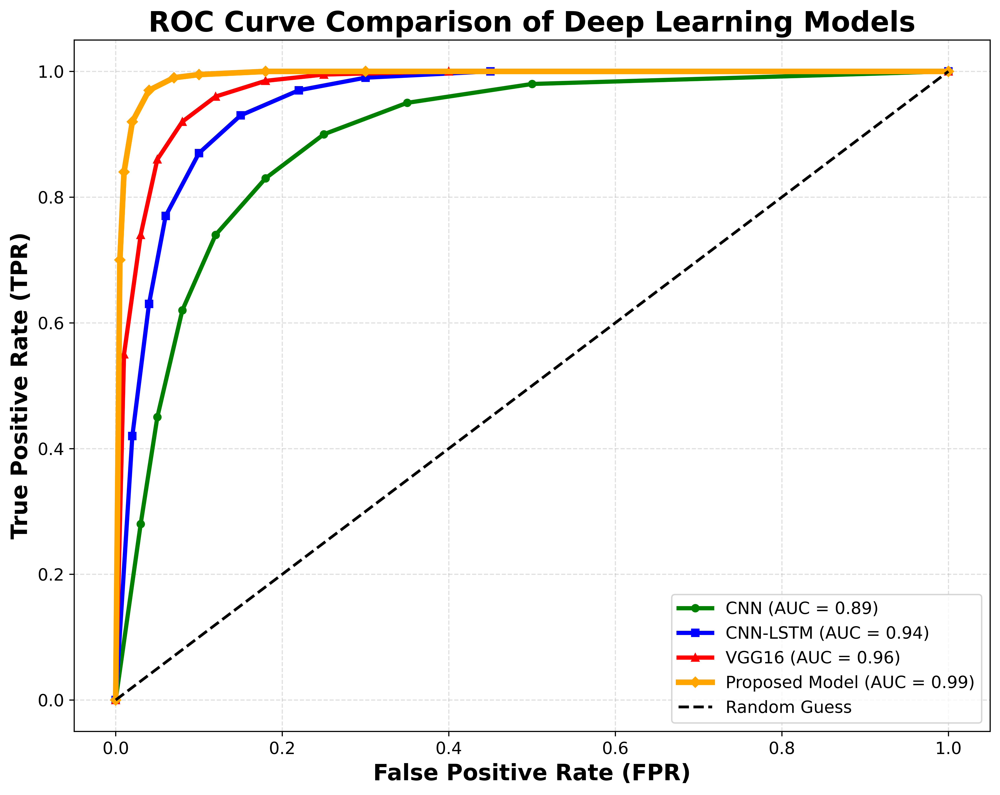
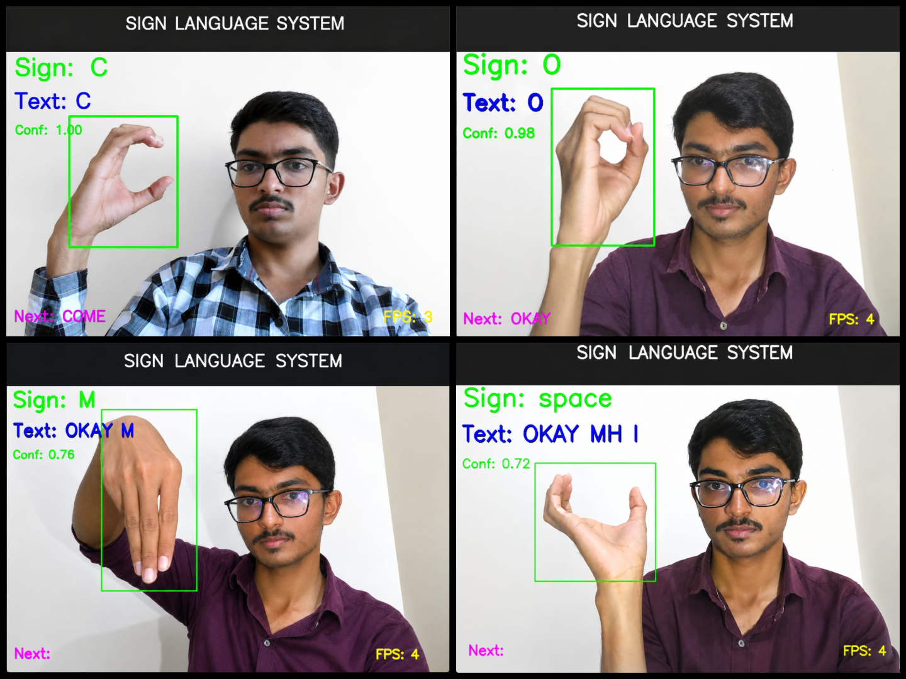

# 🤟 Real-Time Sign Language Recognition Using Deep Learning and Computer Vision

> An AI-powered real-time sign language recognition system that converts American Sign Language (ASL) hand gestures into text and speech using deep learning and computer vision.

---

## 📌 Project Overview

This project is an AI-powered Real-Time Sign Language Recognition System that converts American Sign Language (ASL) hand gestures into text and speech.

The system captures hand gestures through a webcam, detects hand landmarks using MediaPipe, and recognizes the gestures using a deep learning model based on VGG16, Self-Attention, and LSTM. The recognized gesture is displayed as text and is also converted into speech using a Text-to-Speech (TTS) system.

The model was trained and tested on the ASL Alphabet Dataset and provides fast and accurate real-time recognition, helping improve communication for people with hearing and speech impairments.

## 🔄 System Architecture

The following diagram shows the overall workflow of the proposed real-time sign language recognition system.

  

## ✨ Features

- 🎥 Real-time sign language recognition using a webcam.
- 🖐️ Hand landmark detection with MediaPipe.
- 🧠 Deep learning model based on VGG16, Self-Attention, and LSTM.
- 📝 Converts hand gestures into text.
- 🔊 Converts recognized text into speech using Text-to-Speech (TTS).
- 🔤 Supports American Sign Language (ASL) alphabet recognition.
- ⚡ Fast and accurate real-time prediction.
- 📊 Model evaluation using Accuracy, Loss, ROC Curve, and Confusion Matrix.
- ♿ Helps improve communication for people with hearing and speech impairments.

## 🧠 Proposed Deep Learning Model

The proposed model combines computer vision and deep learning techniques to recognize sign language gestures accurately in real time.

It consists of the following components:

- 📷 **Input Image:** Captures hand gesture images through a webcam.
- 🖐️ **MediaPipe:** Detects hand landmarks and extracts hand regions.
- 🧩 **VGG16:** Extracts important visual features from the hand images.
- 🎯 **Self-Attention Layer:** Focuses on the most relevant gesture features.
- 🔄 **LSTM:** Learns the sequence of hand movements for better prediction.
- 🏷️ **Dense + Softmax Layer:** Classifies the detected gesture into the correct ASL alphabet.

  

## 🔄 Algorithm Flow

The following diagram shows the complete process of the proposed sign language recognition system, from capturing hand gestures to generating text and speech output.

  

### Working Process

1. Capture live video using a webcam.
2. Detect hand landmarks using MediaPipe.
3. Crop and preprocess the hand image.
4. Extract gesture features using the VGG16 model.
5. Enhance important features using the Self-Attention layer.
6. Process the features using the LSTM layer.
7. Classify the gesture using Dense and Softmax layers.
8. Convert the recognized gesture into text.
9. Convert the generated text into speech using the Text-to-Speech (TTS) module.

## 🛠️ Technologies Used

🔹 **Programming Language:** Python 3.10

🔹 **Deep Learning Framework:** TensorFlow 2.13.0, Keras 2.13.1

🔹 **Computer Vision:** OpenCV 4.8.0

🔹 **Hand Detection:** MediaPipe Hands

🔹 **Model Architecture:** VGG16 + Self-Attention + LSTM

🔹 **Image Processing:** NumPy

🔹 **Dataset:** ASL Alphabet Dataset (Kaggle)

🔹 **Development Environment:** Visual Studio Code

🔹 **Operating System:** Windows 10 (64-bit)

## 📂 Dataset

The model was trained and tested using the **ASL Alphabet Dataset** available on Kaggle.

🔹 **Dataset Name:** ASL Alphabet Dataset

🔹 **Source:** Kaggle

🔹 **Total Classes:** 29 (A–Z, Space, Delete, Nothing)

🔹 **Images Used:** 11,600 (400 images per class)

🔹 **Input Image Size:** 160 × 160 × 3

🔹 **Dataset Link:** https://www.kaggle.com/datasets/grassknoted/asl-alphabet

## 📊 Results

The proposed VGG16 + Self-Attention + LSTM model achieved high accuracy for real-time sign language recognition. The following figures present the training and evaluation results.

### 📈 Training Performance

  
  

### 🎯 Model Evaluation

  
  

### 📊 Model Comparison

  

📄 **Note:** Detailed classification results and evaluation metrics are available in the `comparison_results` folder.

## 📸 Project Demo

The following images show the real-time working of the Sign Language Recognition System.

  

